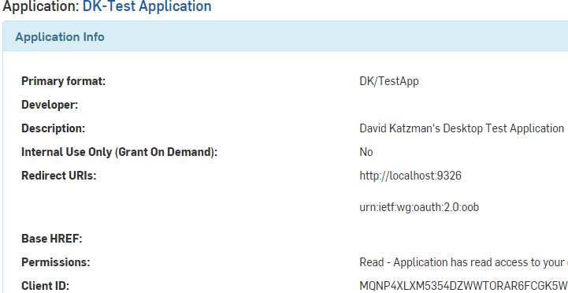
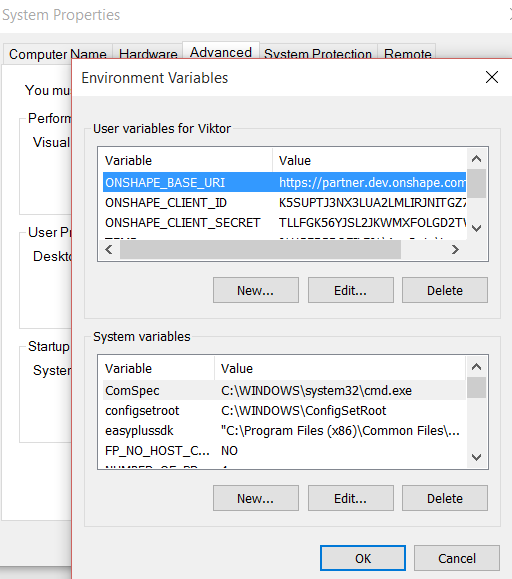
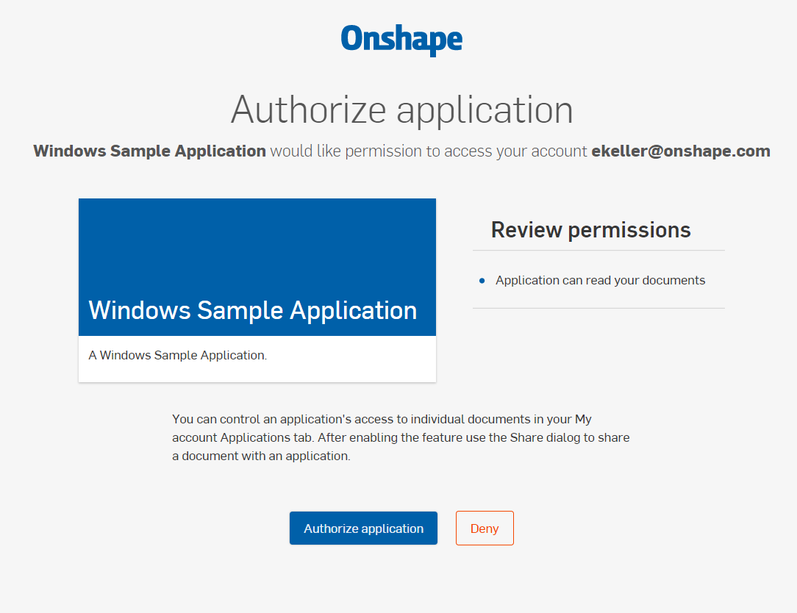
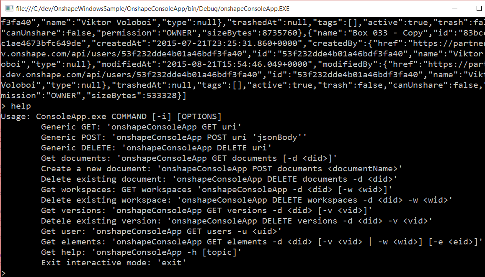

# Onshape Windows Sample

Onshape Windows Sample is a collection of sample projects which demonstrate Onshape OAuth authentication and Onshape REST API workflow on Windows platform. 

## Prerequisites

- [Visual Studio 2013](https://www.visualstudio.com/en-us/news/vs2013-community-vs.aspx) 

- [Registered Onshape App](https://dev-portal.onshape.com/oauthApps).

Sample Onshape App registration parameters:



`ONSHAPE_BASE_URI` should be set to `https://cad.onshape.com` The Client Id, and Client Secret used by the sample are extracted from the environment variables and should match the values from the [Developer Portal](https://dev-portal.onshape.com) 

Environment variables can be set in developer command prompt before launching Visual Studio:

```
>SET ONSHAPE_BASE_URI=https://cad.onshape.com 
>SET ONSHAPE_CLIENT_SECRET=TLLFGK56YJSL2... 
>SET ONSHAPE_CLIENT_ID=K5SUPTJ3NX3LUA2...  
```

or set globally in the configuration panel:



## How to run

Open OnshapeWindowsSample.sln solution in Windows UI, or in developper command prompt:

```
>cd c:\dev\OnshapeWindowsSample
>devenv OnshapeWindowsSample.sln
```

Select "Debug > Start Debugging" in Visual Studio menue to start the sample.

Onshape authentication page in a browser should appear:



List of the user's document should be printed in JSON format, and interactive prompt should appear:



## Projects

- OnshapeClient - a .NET library, skeleton project which encapsulates Onshape REST API interface;

- OnshapeConsoleApp - .NET executable, a skeleton console application whch wraps some of the REST API entry points into commands exposed through the command line interface.

## References

- [ Onshape developper portal](https://dev-portal.onshape.com)
- [ Visual Studio Community Edition](https://www.visualstudio.com/en-us/news/vs2013-community-vs.aspx)
